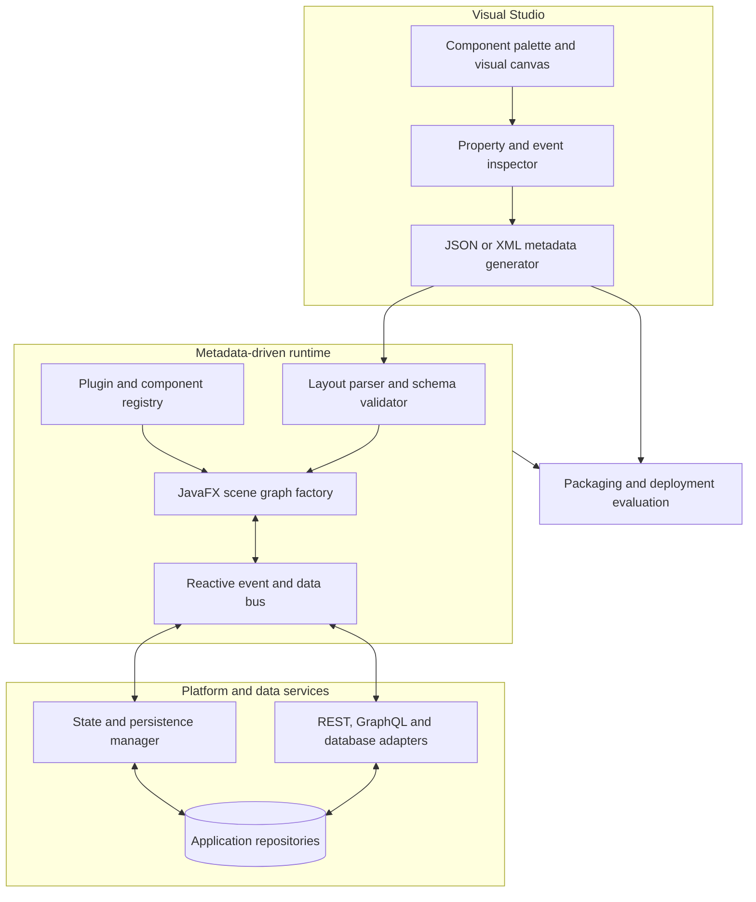
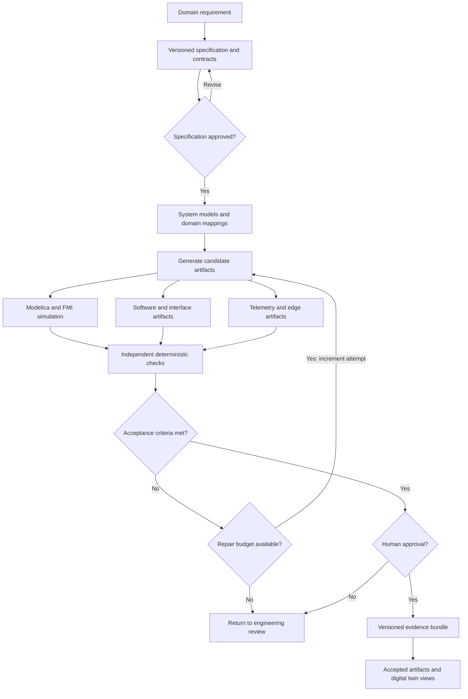
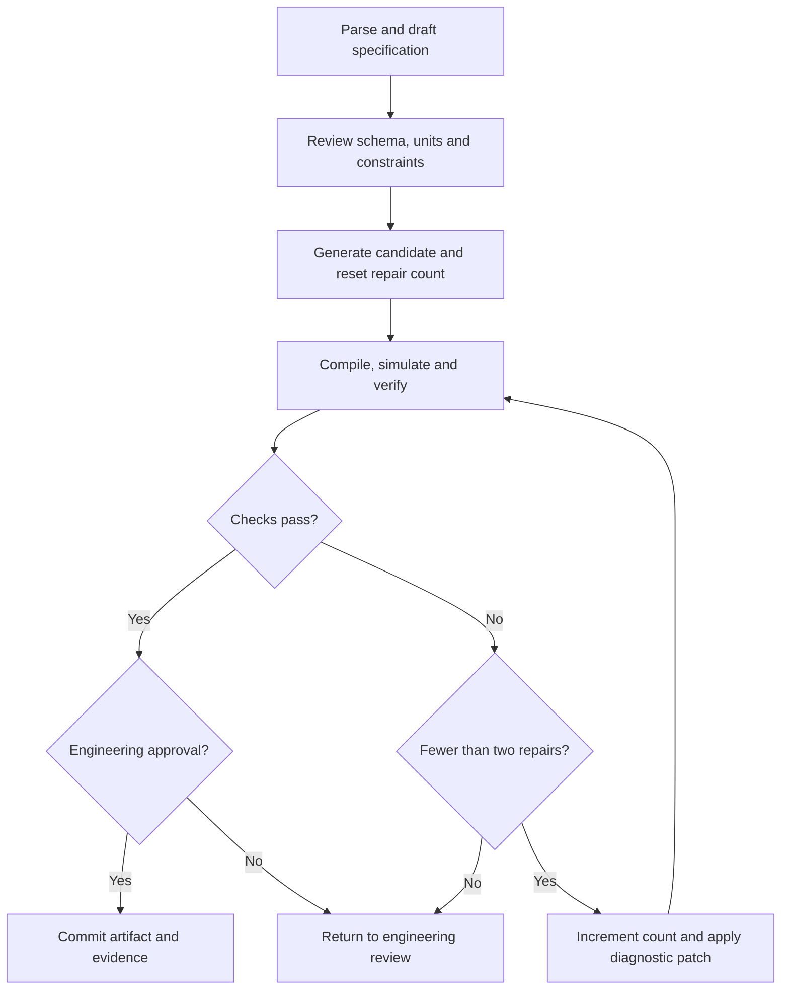
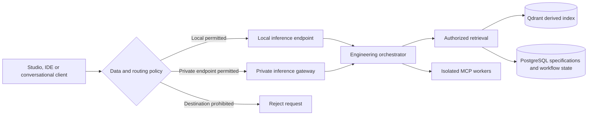
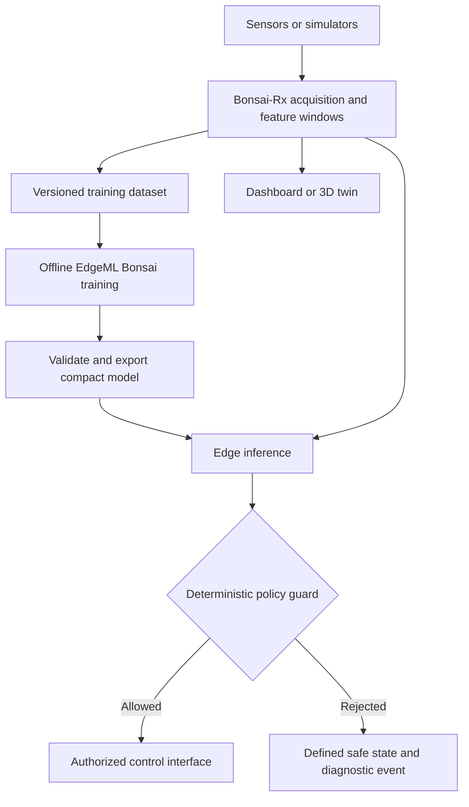

# JFXLCDP

## Low-Code Development Platform for AI-Assisted Systems Engineering

JFXLCDP is a reference architecture and documentation project for a metadata-driven
low-code platform. It explores JavaFX interface generation, AI-assisted analysis,
and model-based systems engineering (MBSE), connecting declarative application
specifications with software artifacts, physical simulation and digital twins.

The proposed design combines a visual studio, a schema-validated runtime and
service adapters. Rascal-based analysis and GraalVM integration are research
workstreams. This repository currently contains documentation and design diagrams,
not a runnable platform or verified integrations. Roadmaps describe intended work.

## Table of Contents

- [Project Scope](#project-scope)
- [Low-Code Platform Architecture](#low-code-platform-architecture)
- [Specification-to-Evidence Workflow](#specification-to-evidence-workflow)
- [AI Orchestration and Tool Contracts](#ai-orchestration-and-tool-contracts)
- [Private Inference and Knowledge Retrieval](#private-inference-and-knowledge-retrieval)
- [Simulation and Independent Verification](#simulation-and-independent-verification)
- [Reactive Telemetry and Edge Intelligence](#reactive-telemetry-and-edge-intelligence)
- [Candidate Technology Stack](#candidate-technology-stack)
- [Implementation Roadmap](#implementation-roadmap)
- [Security and Engineering Governance](#security-and-engineering-governance)
- [Consolidated Engineering Guide](docs/architecture/engineering-methodology-and-implementation-plan.md)
  - [UML and Enterprise Architecture Methods](docs/architecture/engineering-methodology-and-implementation-plan.md#modeling-methods)
  - [GraalModelica Integration Proposal](docs/architecture/engineering-methodology-and-implementation-plan.md#graalmodelica-integration-proposal)
  - [Reverse Engineering and Low-Code Runtime Plan](docs/architecture/engineering-methodology-and-implementation-plan.md#reverse-engineering-and-low-code-runtime-plan)
  - [AI Analysis Prompt Templates](docs/architecture/engineering-methodology-and-implementation-plan.md#ai-analysis-prompt-templates)
- [Design Sources](#design-sources)

## Project Scope

The architecture targets robotics, automation and multidomain engineering tools.
Its organizing principle is a versioned specification with explicit requirements,
interfaces, units and acceptance criteria. Generated artifacts remain candidates
until compilers, solvers, independent checks and engineering review accept them.

Intended outputs include:

- JSON/XML layouts, form schemas and JavaFX scene graphs.
- UML/SysML models, traceability records and Modelica integration contracts.
- Software stubs for C/C++, Rust, ROS 2, gRPC and other selected targets.
- Simulation jobs, verification reports and low-code parameter dashboards.
- Telemetry views and optional Godot/O3DE digital twin visualizations.

## Low-Code Platform Architecture

This view separates design-time authoring, runtime responsibilities and external
services. It condenses the existing [Draw.io architecture](MBSE/CAS/Drawio/architecture/jfxlcdp-high-level-architecture.drawio).

Packaging candidates include `jpackage` and GraalVM Native Image. JavaFX,
GraalPy, native libraries and reflection/resource requirements need a compatibility
prototype before a packaging approach is selected.

## Specification-to-Evidence Workflow

The generation loop permits at most two repairs per candidate. Each artifact links
to requirement IDs and the exact specification revision. Changes trigger explicit
regeneration and validation; bidirectional traceability does not imply automatic
semantic equivalence between models.

## AI Orchestration and Tool Contracts

A proposed LangGraph workflow coordinates retrieval, drafting and isolated tools.
Compiler success alone is insufficient: numerical and contract checks follow it.

| Tool class | Proposed operations | Boundary |
| --- | --- | --- |
| Read-only | `knowledge_search`, `retrieve_specification`, `inspect_modelica_contract`, `get_simulation_result` | Project access filters |
| Controlled execution | `spec_validate`, `modelica_check`, `simulation_submit`, `generate_code_stub` | Schema validation, resource limits and isolated workers |
| Approval required | `create_patch`, `modify_specification`, `publish_artifact`, `deploy_service` | Explicit approval and audit record |

These names describe proposed MCP contracts, not tools implemented here.

## Private Inference and Knowledge Retrieval

The earlier reference design names gpt-oss-20b/120b with Ollama, llama.cpp or vLLM
as inference candidates. Hardware sizing, licensing, runtime compatibility and
privacy controls require evaluation. Conversational client integration, previously
called the Astra Max plugin proposal, is an unimplemented adapter concept; no
specific product integration or offline capability is established by this repo.

PostgreSQL is the proposed authoritative store for specifications, job state,
traceability and review records. Qdrant holds derived embeddings and must enforce
the same project/tenant access boundaries during retrieval.

## Simulation and Independent Verification

OpenModelica/OMPython and FMI-based adapters are candidate execution backends.
Contracts must define units, input/output direction, parameter ranges, solver
configuration and acceptance tolerances before simulation.

An illustrative thermal RC benchmark checks passive cooling against:

$$
T(t) = T_{\mathrm{ambient}} + (T_{\mathrm{initial}} - T_{\mathrm{ambient}})
\exp\left(-\frac{t}{R_{\mathrm{th}}C_{\mathrm{th}}}\right)
$$

| Parameter | Example value |
| --- | --- |
| Initial temperature | 353.15 K |
| Ambient temperature | 293.15 K |
| Thermal resistance | 2.0 K/W |
| Thermal capacitance | 100.0 J/K |
| Maximum absolute error target | 0.05 K |

These are proposed benchmark inputs and a target tolerance, not measured results.
The test must also fix the time grid, solver settings and numerical precision.
An independent worker compares sampled simulation outputs with the analytical
curve and records pass/fail diagnostics.

The evidence bundle should include requirement IDs, specification hash, model
commit, tool versions, solver configuration, result files, assertions and reviewer
identity/signature. Hashes and retention controls support integrity; a database
alone does not make records immutable.

## Reactive Telemetry and Edge Intelligence

Bonsai-Rx stream processing and EdgeML Bonsai compact-tree inference are distinct
candidate technologies. Their integration and latency remain to be validated.

Actuation requires independently validated limits and a system-specific safe-state
strategy. Performance targets, including sub-millisecond inference, require
measurements on the selected hardware.

## Candidate Technology Stack

| Layer | Candidates | Intended role |
| --- | --- | --- |
| Specifications | SRS/SDD, JSON Schema, SysML, UML/XMI | Requirements, interfaces and constraints |
| System architecture | Arcadia/Capella, SysML tooling, OpenMBEE | Models and traceability |
| Analysis and transformation | Rascal M3/AST, transformation adapters | Reverse engineering and domain mappings |
| Low-code runtime | JavaFX, JSON/XML, reactive bindings | Generated interfaces and state |
| Polyglot evaluation | GraalVM, GraalPy, Truffle | Runtime and DSL research |
| AI orchestration | LangGraph, MCP adapters | Bounded workflows and controlled tools |
| Retrieval and storage | Qdrant, PostgreSQL | Derived search index and durable records |
| Physical simulation | OpenModelica, OMPython, FMPy/FMI | Simulation and co-simulation |
| Software targets | C/C++, Rust, ROS 2, gRPC, Ada/SPARK | Domain-specific generated artifacts |
| Telemetry and edge | Bonsai-Rx, EdgeML Bonsai | Streaming and compact inference |
| Visualization | Web forms, Godot, O3DE | Dashboards and digital twins |

## Implementation Roadmap

1. **Requirements and contract harness:** define schemas, acceptance criteria and
   a proposed 30-fixture benchmark spanning retrieval, specification and simulation.
2. **Retrieval and local drafting:** prototype authorized indexing and model routing.
3. **Simulation and verification slice:** implement a narrow Modelica adapter and
   independently check the thermal benchmark.
4. **Reactive integration and scaling:** evaluate telemetry, edge model export,
   deployment isolation and private inference capacity.

The [engineering guide](docs/architecture/engineering-methodology-and-implementation-plan.md)
contains two separate 12-week proposals: cross-domain modeling and low-code reverse
engineering. They are planning estimates, not completed milestones or a single
combined delivery commitment.

## Security and Engineering Governance

Use least-privilege adapters, isolated execution, authenticated service boundaries,
resource limits and data-classification policies. Record tool inputs/outputs and
review decisions with sensitive fields redacted; never store private signing keys
in audit logs. Define retention and artifact-integrity procedures explicitly.

Functional-safety traceability may later support automotive, aerospace or industrial
assurance work. No certification, standards compliance, zero-egress guarantee or
production readiness is claimed. Engineers remain responsible for approving
requirements, generated models and physical control behavior.

## Design Sources

- [Consolidated engineering guide and source mapping](docs/architecture/engineering-methodology-and-implementation-plan.md#source-consolidation)
- [Low-code platform architecture](MBSE/CAS/Drawio/architecture/jfxlcdp-high-level-architecture.drawio)
- [Model-based development process](MBSE/CAS/Drawio/model-based-development-process.drawio)
- [Model-based workflow](MBSE/CAS/Drawio/model-based-workflow.drawio)
- [Multidomain Modelica architecture](MBSE/CAS/Drawio/modex_ai_modelica_open_source_multidomain.drawio)
- [Compiler and tooling reference](MBSE/CAS/Drawio/multi-phase-compiler.drawio)
- [Notebook and simulation reference](MBSE/CAS/Drawio/web-notebook.drawio)

Draw.io files remain editable source references. The Mermaid views above provide
focused, reviewable summaries of the platform architecture and execution flows.
