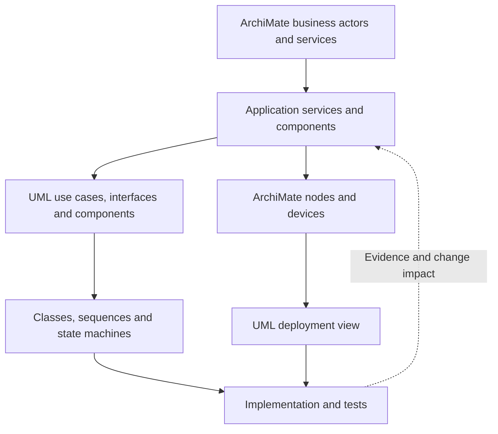
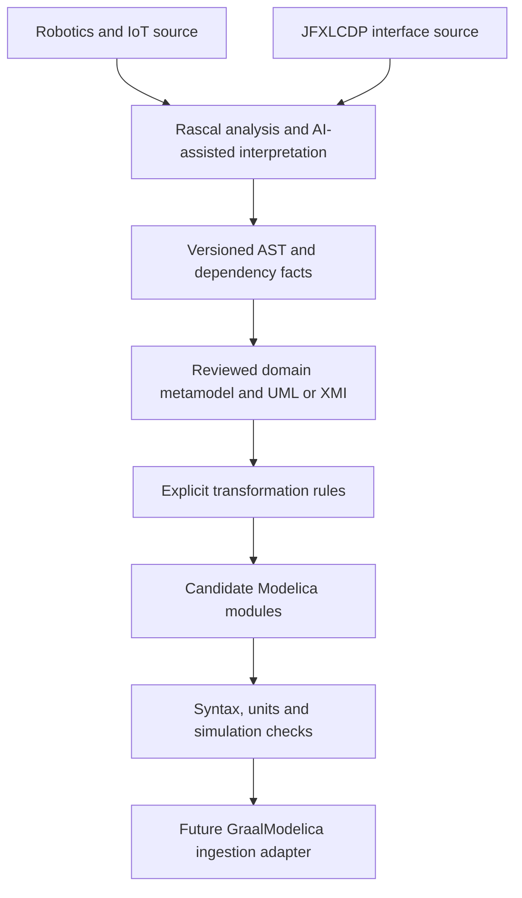
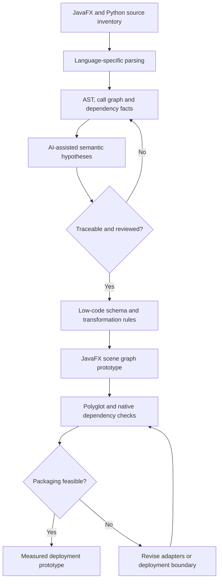
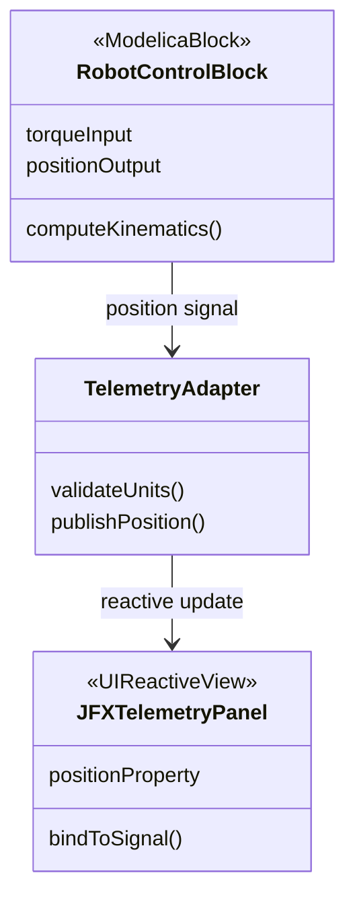

# Engineering Methodology and Implementation Plan

[Back to the main contents](../../README.md#table-of-contents)

This guide consolidates three Spanish working drafts into an English reference
for JFXLCDP. It covers modeling methods, a proposed GraalModelica integration,
and AI-assisted reverse engineering of low-code applications. All integrations,
schedules and examples are proposals unless supported by implementation evidence.

## Contents

- [Modeling Methods](#modeling-methods)
- [Enterprise and Software Architecture Alignment](#enterprise-and-software-architecture-alignment)
- [GraalModelica Integration Proposal](#graalmodelica-integration-proposal)
- [Reverse Engineering and Low-Code Runtime Plan](#reverse-engineering-and-low-code-runtime-plan)
- [AI Analysis Prompt Templates](#ai-analysis-prompt-templates)
- [Analysis and Transformation Examples](#analysis-and-transformation-examples)
- [Acceptance and Evidence](#acceptance-and-evidence)
- [Source Consolidation](#source-consolidation)

## Modeling Methods

| Method | Primary focus | Useful artifacts |
| --- | --- | --- |
| Rational Unified Process (RUP) | Iterative, use-case-driven and architecture-centered development | Use cases, classes, sequences, components and deployment views |
| ICONIX | Lightweight path from domain analysis to design | Domain model, use cases, robustness analysis, sequences and classes |
| Unified Software Development Process (USDP) | General iterative unified-process framework | Use cases, activities, classes, sequences and state machines |
| Agile Model-Driven Development (AMDD) | Sufficient modeling to guide short development and testing cycles | Focused class, sequence and activity sketches |
| Executable UML / model-driven architecture | Precise model semantics and explicit transformations toward executable artifacts | Classes, state machines, action semantics and transformation rules |

### RUP

The proposed use of RUP retains inception, elaboration, construction and transition.
Use cases connect functional requirements with tests. Early executable architecture
prototypes reduce technical risk; subsequent iterations refine class, sequence and
component views instead of treating the first model as final.

### ICONIX

Start with domain objects and short use-case narratives. Robustness analysis
separates boundary, control and entity responsibilities to uncover missing objects
or inconsistent interactions. Sequence diagrams then allocate responsibilities,
and class diagrams capture the resulting design.

### Executable models

An executable modeling approach requires explicit semantics, a supported action
language and tested transformations. Platform-independent models may feed selected
Java, C++ or Rust targets; a diagram or XMI export alone is not executable code.
The original draft mentions ALF as an action-language candidate. Evaluate its
semantics and toolchain support before choosing a generator.

## Enterprise and Software Architecture Alignment

| Approach | Scope | Proposed alignment |
| --- | --- | --- |
| TOGAF ADM with ArchiMate | Enterprise strategy, business, application and technology architecture | Motivation, services, components and implementation planning |
| ArchiMate with UML | Traceability from enterprise application services to software design | Application components to UML components; services to interfaces/use cases |
| Arcadia with Capella | Operational, system, logical and physical architecture | Explicit mappings to the software and simulation models |
| RUP / Enterprise Unified Process with ArchiMate | Iterative software delivery within enterprise portfolio planning | Application services/components linked to release and design artifacts |

Arcadia/Capella is treated as a separate modeling approach, not as a UML or
ArchiMate profile. Cross-tool relationships require documented mappings.



Typical mappings are traceability relationships, not automatic equivalences:

- ArchiMate application component → UML component.
- ArchiMate application service → UML interface or supporting use cases.
- ArchiMate node/device → UML deployment node.

The enterprise view states which services are needed and where they operate. UML
explains internal responsibilities and interactions. Maintain stable IDs across
views to track change impact.

## GraalModelica Integration Proposal

The goal is to prepare robotics/control and low-code interface models for future
GraalModelica-oriented ingestion. The proposal spans projects under `sdk2035` and
`robotics-intelligent-systems`; concrete source repositories and revisions must be
selected before extraction begins.



### Domain contracts

| Domain | Modeling proposal | Required information |
| --- | --- | --- |
| Robotics and control | UML/MARTE timing concepts and system models | Ports, signal direction, timing, equations, kinematics and ROS 2 interfaces |
| UI, desktop and cloud | UML state machines and declarative JSON/XML layouts | Events, bindings, state ownership and update direction |
| Physical integration | Modelica-oriented block/connector mapping | Units, continuous/discrete variables, causal signals and acausal physical connectors |

Keep presentation separate from equations and control logic through a mediator or
adapter. SysML system views, UML state machines and project-specific stereotypes
have distinct roles; custom labels do not establish standard conformance.

### Cross-domain workstream: proposed 12 weeks

| Phase | Window | Work | Reviewable deliverable |
| --- | --- | --- | --- |
| 1. Static extraction | Weeks 1–4 | Extract class, event and dependency facts using language-specific analysis adapters | AST/fact graph plus a documented UML/XMI mapping |
| 2. Cyber-physical decomposition | Weeks 5–8 | Separate JavaFX presentation from Python/C++ control and physical logic | Component/class views with proposed `CyberPhysicalBlock`, `ReactiveBinding` and `PhysicalConnector` stereotypes |
| 3. Modelica transformation | Weeks 9–12 | Define and prototype model-to-Modelica rules | Candidate `.mo` modules or DSL artifacts with validation results |

This is independent of the low-code workstream below. Coordinate through a shared
metamodel version and interface review; do not assume that either schedule proves
the cloud runtime or Truffle integration is available.

## Reverse Engineering and Low-Code Runtime Plan

The second proposal studies Rascal-based analysis of JavaFX and Python/Odoo source,
then evaluates a GraalVM-oriented runtime. These external source targets are not
included in this documentation repository.

| Phase | Window | Work | Exit evidence |
| --- | --- | --- | --- |
| 1. Parsing and extraction | Weeks 1–3 | Build AST and dependency facts; use Rascal M3 where supported and separate Python/native-extension adapters | Versioned source inventory and reproducible extraction sample |
| 2. Semantic analysis | Weeks 4–6 | Use AI to propose business rules, UI bindings and interaction patterns from facts | Reviewed UML views linked to source locations |
| 3. Low-code synthesis | Weeks 7–9 | Define JSON/XML schemas and rendering rules for the JavaFX scene graph | Valid/invalid fixtures, binding rules and a small renderer prototype |
| 4. Runtime evaluation | Weeks 10–12 | Evaluate JavaFX, GraalPy, native dependencies and packaging | Compatibility matrix, deployment prototype and measured limitations |



Do not assume that a unified process removes JNI/native overhead, that Truffle
optimizes arbitrary UI rendering, or that Native Image supports every dependency.
Assess CPython extensions, interop semantics, JavaFX threading, reflection and
resource access before committing to AOT packaging. Record an alternative runtime
or service boundary when a dependency is incompatible.

## AI Analysis Prompt Templates

These templates support reviewed engineering work. Replace placeholders with
versioned, authorized input and require source references for each inference.

### 1. Cyber-physical model extraction

```text
Act as a systems-modeling and metaprogramming engineer.
Analyze <RASCAL_AST_OR_XMI_WITH_SOURCE_LOCATIONS> from the selected robotics
and JFXLCDP repositories.
Produce a Mermaid class diagram and a mapping table:
- Mark control/signal nodes with the proposed ModelicaBlock stereotype.
- Mark JavaFX presentation nodes with the proposed UIReactiveView stereotype.
- Specify input/output direction, units, state ownership and event semantics.
- Separate presentation from control through a mediator or adapter.
- Identify unsupported mappings and distinguish facts from hypotheses.
Do not claim SysML/MARTE conformance without checking the selected metamodel.
```

### 2. Sequence-to-Modelica interface mapping

```text
Given <REVIEWED_UML_SEQUENCE_AND_INTERFACE_CONTRACTS>, propose a Modelica
interface mapping for the JFXLCDP console and robotics engine.
Distinguish synchronous calls, asynchronous events, causal signals and acausal
physical connectors; do not translate calls mechanically into connect equations.
Identify candidate Real, Integer and Boolean variables, units and event boundaries.
List adapters and validation cases required for a future GraalModelica runtime.
Treat AOT access and Truffle support as compatibility questions, not guarantees.
```

### 3. Package and component analysis

```text
Act as a software architect specializing in metamodels.
Using <RASCAL_M3_OR_LANGUAGE_SPECIFIC_FACTS>, produce a Mermaid component-level
flowchart with source references and an explicit dependency table.
Identify coupling between metadata processing and visual controls.
Recommend adapters for CPython/native extensions and state which proposed
GraalVM integrations still need a compatibility experiment.
```

### 4. Declarative rendering analysis

```text
Using <PARSER_SOURCE_SCHEMA_AND_AST>, propose language-neutral pseudocode that:
1. Validates JSON/XML layout data before creating JavaFX nodes.
2. Resolves component types through a registry and constructs a scene hierarchy.
3. Applies explicit one-way or two-way property bindings through a reactive bus.
4. Handles invalid components, event cycles and binding cleanup.
5. Respects the JavaFX application thread and measures scene initialization.
Separate algorithmic improvements from unverified JIT or Truffle assumptions.
```

## Analysis and Transformation Examples

### UI and physical model boundary



The stereotypes are proposed project labels. The adapter owns unit conversion,
update scheduling and the presentation boundary. This diagram replaces the draft
PlantUML example; it is not a compilable model or a formal UML interchange file.

### Static-analysis sketch

The original draft proposed `JFXLCDPAnalyzer` and a Rascal Java M3 extraction call.
The following pseudocode preserves that intent without presenting unverified API
calls or a Java-only extractor as a Python analyzer:

```text
function analyzeCoreComponents(sourceRevision):
    inventory = enumerateSources(sourceRevision)
    javaFacts = extractJavaM3(inventory.javaSources, resolvedJavaClasspath)
    pythonFacts = extractPythonFacts(inventory.pythonSources, selectedPythonParser)
    nativeBoundaries = inventoryNativeExtensions(inventory)
    facts = normalizeWithSourceLocations(javaFacts, pythonFacts, nativeBoundaries)
    uiClasses = selectReviewedUIComponents(facts)
    callGraph = extractInvocationEdges(facts)
    return AnalysisBundle(sourceRevision, uiClasses, callGraph, nativeBoundaries)
```

Pin the Rascal version and verify extractor APIs against a real sample project
before implementing this sketch. Calls, containment and type relationships must
retain source locations and unresolved-reference diagnostics.

### Declarative renderer sketch

```text
function render(layout, registry, reactiveBus):
    validateSchemaAndBindings(layout)
    tree = resolveComponentsAndProperties(layout, registry)
    onJavaFXApplicationThread:
        root = buildSceneGraph(tree)
        subscriptions = attachValidatedBindings(root, reactiveBus)
    return ViewHandle(root, dispose = subscriptions.cancelAll)
```

Reject unknown components and incompatible property types before exposing the
view. Document conflict resolution for bidirectional bindings and avoid event
feedback loops. Runtime-specific optimization follows measurement.

## Acceptance and Evidence

For each prototype, retain the input revision, metamodel/schema version,
transformation version, generated artifacts, diagnostics and review decision.

- **Extraction:** cover Java, Python and native boundaries separately; report
  unsupported syntax and unresolved dependencies.
- **Metamodel:** check stable IDs, source traceability, units, port direction and
  separation of control from presentation.
- **Transformation:** compare small reviewed input/output fixtures and report
  semantic information that cannot be preserved.
- **Runtime:** measure startup, binding behavior and interop on the chosen platform;
  test invalid layouts and resource cleanup.
- **Simulation:** compile candidate models and run independent numerical checks
  before treating generated results as accepted engineering evidence.

## Source Consolidation

The three former `.txt` drafts are consolidated here. Their earlier versions
remain in Git history; this table records where their content moved.

| Former draft | Consolidated coverage |
| --- | --- |
| `docs/A continuación se detalla.txt` | Modeling methods; RUP, ICONIX and executable models; ArchiMate/UML alignment |
| `docs/Esta propuesta técnica.txt` | GraalModelica proposal; domain contracts; 12-week cross-domain workstream; prompts 1–2; model boundary example |
| `docs/Este plan de trabajo técnico.txt` | Reverse-engineering plan; 12-week low-code workstream; prompts 3–4; static-analysis and rendering sketches |

The consolidation removes conversational commit instructions, replaces ASCII and
PlantUML sketches with Mermaid, and makes feasibility assumptions explicit.
